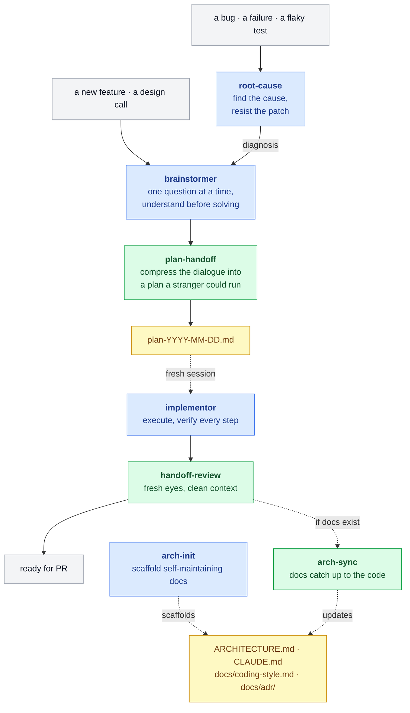

# pilat-marketplace

Skills for Claude Code that understand the problem before writing the solution.

Most AI coding setups optimize for one thing: get to code fast. This one optimizes for getting the code right the first time, which usually means not writing it yet. It's a small pipeline of skills that take Claude Code from a fast guesser to a deliberate partner: explore, plan, build, review. Plus a separate track for bugs, where the rule is diagnose before you fix.

## The idea

**A model is a pattern-completer, not a mind-reader.** Hand it "add photo sharing" and it has to guess at a thousand unstated requirements; you find out which guesses were wrong somewhere deep in the implementation. So the first skill in the chain doesn't write anything. It asks, one question at a time, and reads your real code until the problem is actually understood. [GitHub makes the same case](https://github.blog/ai-and-ml/generative-ai/spec-driven-development-with-ai-get-started-with-a-new-open-source-toolkit) for spec-driven development.

**Long context rots.** A model's recall slips as its window fills up. Anthropic calls it [context rot](https://www.anthropic.com/engineering/effective-context-engineering-for-ai-agents), the effect needle-in-a-haystack tests are built to catch. It's a gradient, not a cliff, but a three-hour exploration is exactly the bloated context where the decision you made an hour ago starts getting buried. So the plan gets written to a file, and implementation starts in a *fresh* session that isn't dragging the whole exploration behind it.

**Mistakes get more expensive the longer they live.** A wrong assumption caught in conversation costs a sentence. The same assumption caught after the code is written costs a rewrite. Every handoff in the chain (exploration to plan, plan to build, build to review) is a checkpoint to catch the problem while it's still cheap. That's the plain intuition behind shift-left, and you don't need the disputed cost-curve numbers for it to hold.

**You can't review your own code.** You see what you meant, not what's on the screen. It's worse with AI-written code: it looks intentional (clean names, idiomatic structure), so it slides past the instinct that makes a reviewer slow down. So the last step brings in fresh eyes: separate subagents with no memory of writing the code, usually a cheaper model like Sonnet, each hunting for what the author's eye skipped.

And one choice runs through all of them: the skills lean on persuasion, not command. Where a typical skill leads with "you MUST," these mostly name the trap and give the reason; the hard rules are saved for the handoff seams, where a skipped step quietly breaks the chain. The bet: a model that understands why not to patch a symptom can spot the exception a blanket rule would just steamroll. Whether it pays off is yours to judge. The skills are short, and the reasoning is right there on the surface.

## The pipeline



Blue is a skill you invoke. Green runs automatically once the pipeline reaches it. Yellow is an artifact that survives between sessions: the plan and the architecture docs. Grey is where you start and finish.

There are two ways in. A new feature starts at **brainstormer**. A bug starts at **root-cause**, which diagnoses it and hands the diagnosis to the same place, so a fix is explored like any other change instead of reflex-patched. From there it's a single line: understand, write the plan, **start a fresh session**, build, review, open the PR. That fresh-session step is the load-bearing one: the plan file is where the exploration context gets dropped on purpose, so implementation runs in a clean window.

Off to the side, drawn in dotted lines, is the optional architecture-docs track: `arch-init` scaffolds the docs once (ARCHITECTURE.md, CLAUDE.md, a coding-style doc, an ADR log), and after each cycle `arch-sync` brings them back in step with the code. No docs, no sync, and it stays out of the way.

## Installation

```bash
/plugin marketplace add pilat/pilat-marketplace
/plugin install pilat@pilat-marketplace
```

## Skills

### brainstormer

Your entry point for anything new. Explore before you build. It asks one question at a time and reads your actual code instead of guessing, until the problem is genuinely understood. No solutions until they're earned.

```
/pilat:brainstormer I want to add caching to our API
```

### plan-handoff *(automatic)*

The bridge between thinking and doing. When exploration is done, brainstormer calls this to compress everything you decided — the constraints, the rejected alternatives, the edge cases — into a dated plan file a fresh session can execute without you in the room. Not user-invocable.

### implementor

Execute the plan. Start a clean session and point it at the plan file. It works through the tasks in order and runs the actual check after each one (test, build, lint, whatever applies), reading the output instead of claiming a pass from memory. That's an instruction, not a hard gate, but it makes skipping verification the conspicuous exception.

```
/pilat:implementor
```

### handoff-review *(automatic)*

The moment implementor finishes, it hands the diff to a panel of fresh-eyes subagents, usually a cheaper model like Sonnet. Each one takes a different angle, looking for what the author's eye slid past. It fixes the clear wins and reports the rest. Not user-invocable.

### root-cause

Start here when it's a bug. A bug shows at the symptom, but the cause is usually upstream. This skill holds the line: reproduce it, trace the bad value back to where it's born, resist the reflex patch. Then it hands the diagnosis to brainstormer so the fix goes through the same pipeline as everything else. Claude may pull it in automatically when you hit a crash or a flaky test, or you can invoke it directly.

```
/pilat:root-cause checkout total is wrong for multi-currency carts
```

### arch-init

Set up architecture docs that maintain themselves. Run it once per project. It studies the codebase and scaffolds `ARCHITECTURE.md`, `CLAUDE.md`, a coding-style doc, and an ADR log, each carrying its own project-specific rules for staying in sync. It skips monorepos (one doc can't honestly describe several independently-shipped services) and trivial repos (nothing to document) on purpose.

```
/pilat:arch-init
```

### arch-sync *(automatic)*

After implementor ships, if the project has an `ARCHITECTURE.md`, this reads the diff and quietly updates the docs to match: fixing drift, flagging anything that looks like code violating its own stated patterns. Docs follow code, never the reverse. Not user-invocable.

### skill-creator

Write more skills like these. A meta-skill that turns a rough idea into a tested, well-structured `SKILL.md`, following the same unforced design the rest of this plugin uses.

```
/pilat:skill-creator I need a skill for reviewing SQL migrations
```

## Agents

### humanizer *(automatic)*

Rewrites user-facing text (PR descriptions, commit messages, docs) to read like a person wrote it. Kills the AI tells: the "delve," the em-dash pileups, the "it's not X, it's Y." It's meant to be pulled in automatically when a skill is about to show you prose.

## When to use what

| Situation | Reach for |
|-----------|-----------|
| New feature, not sure how to approach it | brainstormer |
| Something's broken and I want the cause, not a band-aid | root-cause |
| We talked it through, now write the plan | plan-handoff (automatic) |
| Plan's ready, build it | implementor |
| It's built, review it | handoff-review (automatic) |
| Set up architecture docs for this project | arch-init |
| Did the code drift from the docs? | arch-sync (automatic) |
| I want to build a new skill | skill-creator |
| Writing a PR description or commit | humanizer (automatic) |

## Prior art

The two-step spine, explore then implement, started as a rebuild of [obra/superpowers](https://github.com/obra/superpowers). superpowers uses a command-style voice ("you MUST," iron laws); these took a different tack (see above) and are rewritten rather than forked. Different philosophy, same debt — the structure and a lot of the thinking started there.

The shape it converged on (understand, then plan, then build) is the same one the industry landed on with spec-driven development (GitHub's Spec Kit: Specify, Plan, Tasks, Implement). Same conclusion from a different direction: an agent does better work when it knows what it's building before it starts.

## License

MIT
