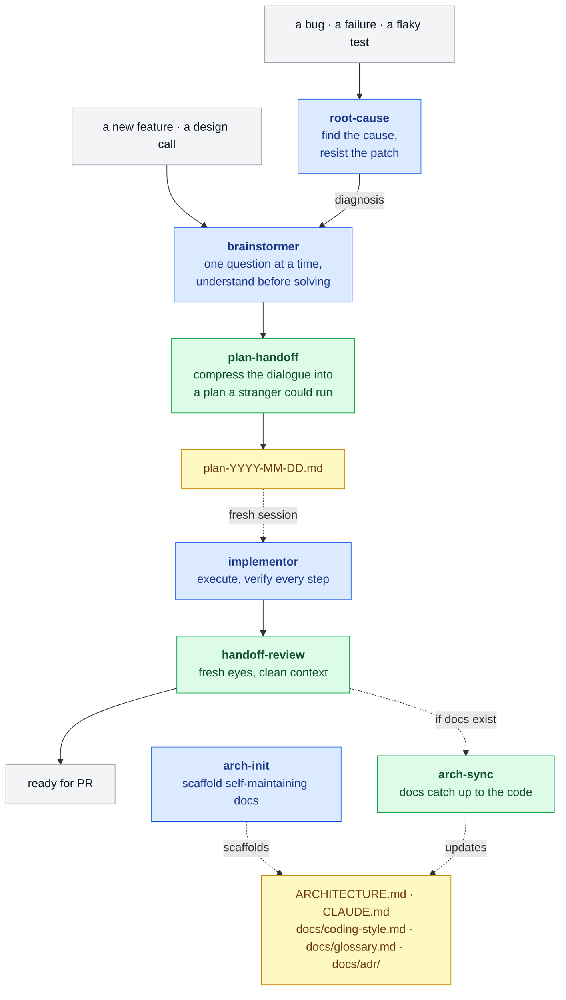

# pilat-marketplace


Skills for Claude Code that understand the problem before writing the solution.

Most AI coding setups optimize for one thing: get to code fast. This one optimizes for getting the code right the first time, which usually means not writing it yet. A small pipeline of skills takes Claude Code from a fast guesser to a deliberate partner — explore, plan, build, review — plus a separate entrance for bugs, where the rule is diagnose before you fix.

## Install

```bash
/plugin marketplace add pilat/pilat-marketplace
/plugin install pilat@pilat-marketplace
```

## What it feels like

You say:

```
/pilat:brainstormer I want to add rate limiting to the API
```

A typical assistant answers with a middleware file and a config block. Brainstormer reads your API layer first, notices the token-bucket helper your webhook sender already uses, and comes back with one question:

> Is this about protecting the API from outside traffic, or about one internal consumer starving the others? Those want different designs.

One question per message, each earned by reading real code before asking. When new questions start refining the picture instead of redirecting it, exploration is done: the decisions compress into a plan file, critics with no memory of the conversation attack the plan, and a fresh session builds it. The exchange above is illustrative — the behavior is what the skills are written to produce.

## The pipeline



Blue is a skill you invoke. Green runs automatically once the pipeline reaches it. Yellow is an artifact that survives between sessions: the plan and the architecture docs. Grey is where you start and finish.

There are two ways in. A new feature starts at **brainstormer**. A bug starts at **root-cause**, which diagnoses it and hands the diagnosis to the same place, so a fix is explored like any other change instead of reflex-patched. From there it's a single line: understand, write the plan — fresh critics attack it before it's final — **start a fresh session**, build, review, open the PR. That fresh-session step is the load-bearing one: the plan file is where the exploration context gets dropped on purpose, so implementation runs in a clean window.

One shortcut exists: a purely mechanical change — nothing weighed, nothing chosen — is implemented right in the brainstormer session, skipping the plan; with zero decisions there's nothing for a plan to transport and nothing for its critics to attack. The shortcut skips the deciding, not the shipping: fresh-eyes review and doc sync still run, same as after a planned build.

Off to the side, drawn in dotted lines, is the optional architecture-docs track: `arch-init` scaffolds the docs once (ARCHITECTURE.md, CLAUDE.md, a coding-style doc, a project glossary, an ADR log), and after each cycle `arch-sync` brings them back in step with the code. No docs, no sync, and it stays out of the way.

## Why it's built this way

**A model is a pattern-completer, not a mind-reader.** Hand it "add photo sharing" and it has to guess at a thousand unstated requirements; you find out which guesses were wrong somewhere deep in the implementation. So the first skill in the chain doesn't write anything. It asks, one question at a time, and reads your real code until the problem is actually understood. [GitHub makes the same case](https://github.blog/ai-and-ml/generative-ai/spec-driven-development-with-ai-get-started-with-a-new-open-source-toolkit) for spec-driven development.

**Long context rots.** A model's recall slips as its window fills up. Anthropic calls it [context rot](https://www.anthropic.com/engineering/effective-context-engineering-for-ai-agents), the effect needle-in-a-haystack tests are built to catch. It's a gradient, not a cliff, but a three-hour exploration is exactly the bloated context where the decision you made an hour ago starts getting buried. So the plan gets written to a file, and implementation starts in a *fresh* session that isn't dragging the whole exploration behind it.

**Mistakes get more expensive the longer they live.** A wrong assumption caught in conversation costs a sentence. The same assumption caught after the code is written costs a rewrite. Every handoff in the chain (exploration to plan, plan to build, build to review) is a checkpoint to catch the problem while it's still cheap. That's the plain intuition behind shift-left, and you don't need the disputed cost-curve numbers for it to hold.

**You can't review your own code.** You see what you meant, not what's on the screen. It's worse with AI-written code: it looks intentional (clean names, idiomatic structure), so it slides past the instinct that makes a reviewer slow down. So the last step brings in fresh eyes: separate subagents with no memory of writing the code, usually a cheaper model like Sonnet, each hunting for what the author's eye skipped.

And one choice runs through all of them: the skills lean on persuasion, not command. Where a typical skill leads with "you MUST," these mostly name the trap and give the reason; the hard rules are saved for the handoff seams, where a skipped step quietly breaks the chain. The bet: a model that understands why not to patch a symptom can spot the exception a blanket rule would just steamroll. Whether it pays off is yours to judge. The skills are short, and the reasoning is right there on the surface.

## Skills

### brainstormer

Your entry point for anything new. Explore before you build. It asks one question at a time and reads your actual code instead of guessing, until the problem is genuinely understood. No solutions until they're earned. If the project keeps a glossary or an ADR log, it speaks that vocabulary and won't silently re-litigate a settled decision.

```
/pilat:brainstormer I want to add caching to our API
```

### plan-handoff *(automatic)*

The bridge between thinking and doing. When exploration is done, brainstormer calls this to compress everything you decided — the constraints, the rejected alternatives, the edge cases — into a dated plan file a fresh session can execute without you in the room. Then critics who never saw the conversation read the plan cold, each from its own angle:

- **Builder** — where would a stranger have to stop and guess?
- **Reviewer** — where could two reasonable implementers produce different results?
- **Premortem** — this plan shipped and broke in production; what broke?
- **Reuse** — what does this build that the codebase already has?

Scaled to the plan: a one-task fix gets one critic, cross-cutting work gets all four. Every unhandled corner case comes back to you — handled in the plan, or recorded there as consciously out of scope. And questions never get parked in the plan: the implementer can't ask the original human, so a plan containing a question is a plan that blocks. Not user-invocable.

### implementor

Execute the plan. Start a clean session and point it at the plan file. It works through the tasks in order and runs the actual check after each one (test, build, lint, whatever applies), reading the output instead of claiming a pass from memory. When reality disagrees with the plan, it says so out loud instead of silently improvising. `skip`, `status`, `pause`, and `back` work at any point.

```
/pilat:implementor
```

### handoff-review *(automatic)*

The moment the build finishes — implementor's, or a mechanical change made right in brainstormer — it hands the diff to a panel of fresh-eyes subagents, usually a cheaper model like Sonnet. Each one takes a different angle, looking for what the author's eye slid past. It fixes the clear wins and reports the rest. A clean review is reported as exactly that — it means the implementation was solid. Not user-invocable.

### root-cause

Start here when it's a bug. A bug shows itself at the symptom, but the cause lives upstream, and patching the symptom trades one bug for a worse one — the nil-guard that stops a crash by silently dropping payments turns a visible outage into invisible data loss. This skill holds the line: reproduce on demand, shrink the repro, trace the bad value back to where it's born, rank falsifiable hypotheses and kill them one at a time. Then the diagnosis goes to brainstormer, so the fix is designed like any other change — and the repro command rides along as ready-made verification for whatever fix lands. Claude may pull it in automatically when you hit a crash or a flaky test, or you can invoke it directly.

```
/pilat:root-cause checkout total is wrong for multi-currency carts
```

### arch-init

Set up architecture docs that maintain themselves. Run it once per project. It studies the codebase and scaffolds `ARCHITECTURE.md`, `CLAUDE.md`, a coding-style doc, a project glossary (`docs/glossary.md`), and an ADR log, each carrying its own project-specific rules for staying in sync. It skips monorepos (one doc can't honestly describe several independently-shipped services) and trivial repos (nothing to document) on purpose.

```
/pilat:arch-init
```

### arch-sync *(automatic)*

After the build ships — implementor's or the mechanical shortcut's — if the project has an `ARCHITECTURE.md`, this reads the diff and quietly updates the docs to match: fixing drift, flagging anything that looks like code violating its own stated patterns. Docs follow code, never the reverse. Not user-invocable.

### skill-creator

Write more skills like these. A meta-skill that turns a rough idea into a tested `SKILL.md`, built around one instrument: the no-op test — any sentence that doesn't change the model's behavior versus its default gets deleted whole. Drafts run on a clean-context subagent before they ship, because you can't review your own skill for the same reason you can't review your own code.

```
/pilat:skill-creator I need a skill for reviewing SQL migrations
```

## Agents

### humanizer *(automatic)*

Rewrites user-facing text (PR descriptions, commit messages, docs) to read like a person wrote it. Kills the AI tells: the "delve," the em-dash pileups, the "it's not X, it's Y." It's meant to be pulled in automatically when a skill is about to show you prose.

## When to use what

| Situation | Reach for |
|-----------|-----------|
| New feature, not sure how to approach it | brainstormer |
| Something's broken and I want the cause, not a band-aid | root-cause |
| We talked it through, now write the plan | plan-handoff (automatic) |
| Plan's ready, build it | implementor |
| It's built, review it | handoff-review (automatic) |
| Set up architecture docs for this project | arch-init |
| Did the code drift from the docs? | arch-sync (automatic) |
| I want to build a new skill | skill-creator |
| Writing a PR description or commit | humanizer (automatic) |

## What it costs

Friction is the feature here, and it isn't free. The honest ledger:

- **It asks before it writes.** For a change where a wrong guess costs nothing, that's overhead, not discipline. Use the mechanical shortcut — or skip the pipeline entirely. It's built for changes that are expensive to get wrong.
- **It spends more tokens.** Plan critics and review panels are extra model calls. Reviewers usually run on a cheaper model, but a full cycle still costs more than one-shot generation. The bet is that it's cheaper than the rewrite.
- **The gates are persuasion, mostly.** A model can still cut a corner. The design makes that the conspicuous exception rather than the invisible default — but not impossible.
- **The fresh-session handoff is on you.** The pipeline writes the plan; only you can open the clean window and point implementor at it. Skip that step and you drag hours of exploration context into the build — the exact failure the plan file exists to prevent.

## Using it with Codex *(experimental)*

The plugin installs on Codex too — the marketplace ships an `.agents/plugins/marketplace.json` next to the Claude one. Treat it as experimental: the skills were written for Claude, and the two model families read them differently.

The skills are deliberately loose. They name the intent and the trap and trust the model to fill the gaps with judgment — the "persuasion, not command" bet above. Claude tends to do that. Codex follows instructions more literally: excellent when told exactly what to do, but where a skill describes an outcome instead of the steps, it's likelier to read a missing rule as nothing-to-do rather than as room to judge. The looseness that feels natural on Claude can make Codex act thin.

Telling Codex once how these skills are meant to be read closes a lot of that gap. Drop this into `~/.codex/AGENTS.md`, which loads into every Codex session:

```markdown
# Reading Pilat skills

The Pilat skills — brainstormer, plan-handoff, implementor, handoff-review,
root-cause, arch-init, arch-sync, skill-creator — describe intent, not rigid
steps, on purpose. When a step names an outcome instead of exact keystrokes,
work out what serves that outcome and do it. A missing rule is not permission
to skip; it's an instruction to use judgment. When a specific instruction and
the stated goal pull apart, serve the goal. Read the referenced code before
you decide — don't infer behavior by analogy.
```

It's the kind of literal instruction Codex follows well, aimed at making it behave a little less literally. Whether that pays off is yours to judge — we haven't lived with it the way we have the Claude behavior, which is why the whole section wears the experimental tag. Running the exploratory skills at a higher reasoning effort nudges the same way.

## Prior art

The two-step spine, explore then implement, started as a rebuild of [obra/superpowers](https://github.com/obra/superpowers). superpowers uses a command-style voice ("you MUST," iron laws); these took a different tack (see above) and are rewritten rather than forked. Different philosophy, same debt — the structure and a lot of the thinking started there.

The shape it converged on (understand, then plan, then build) is the same one the industry landed on with spec-driven development (GitHub's Spec Kit: Specify, Plan, Tasks, Implement). Same conclusion from a different direction: an agent does better work when it knows what it's building before it starts.

The project glossary in the architecture-docs track is borrowed from [mattpocock/skills](https://github.com/mattpocock/skills), where a shared-vocabulary file stops agents from using twenty words where the project has one. Here it lives at `docs/glossary.md`, seeded by arch-init and grown by brainstormer and arch-sync as ambiguities surface, rather than through a dedicated skill.

## License

MIT
